# Boggle

A web-based version of **Boggle** word game built with Python, Flask, and SQLite.

## Table of Contents

- [About the Project](#about-the-project)
- [Features](#features)
- [Gameplay Flow](#gameplay-flow)
- [File Structure](#file-structure)
- [Getting Started](#getting-started)
    - [Installation](#installation)
- [Usage](#usage)
    - [Examples (Screenshots)](#examples-screenshots)
- [Tech Stack](#tech-stack)
- [References](#references)
- [License](#license)

## About the Project

This project implements a playable, web-based version of Boggle:

- Users play Boggle in the browser against a randomly generated board.
- Words are validated against a dictionary to provide a real-time feedback.
- Game history is stored in a local SQLite database.

## Features

- Customizable board dimensions
- Real-time word validation
- Dictionary lookup for any found word
- Game history tracking with timestamps

## Gameplay Flow

- Generate board: Click the "Generate" button to start with a random N × N board.
- Word submission: Click on letters to form a word, then press "Check word" to validate.
- Display/Hide all words: Toggle to display/hide all possible words in the board.
- Dictionary: Upon toggling the above, click on any word to see its meaning via a dictionary, or go to `/dictionary` and type in a word to check its meaning.
- History: Review past boards and timestamps from the history page.

## File Structure

```bash
├── app.py                  Server-side Python code (main Flask app)
├── boggle.py               Boggle game logic (board generation, word search)
├── db_utils.py             SQLite3/Flask utilities
├── helpers.py              Helper functions
├── requirements.txt        Python dependencies
├── schema.sql              Design of database (for storing game history)
├── static                  Static content for web pages (Images, JavaScript, CSS files)
│   ├── dictionaries/       Word lists used for validation
│   └── styles.css
├── templates               Jinja HTML templates
|   ├── layout.html         Blueprint of HTML files (i.e. Base layout for all HTML pages)
|   └── *.html              Game and results pages
├── LICENSE
└── README.md
```

## Getting Started

### Installation

1. Clone this repository:
    ```
    git clone https://github.com/Matt1479/Boggle
    ```
2. (Optional) Change Git remote URL to avoid pushing to the original:
    ```bash
    git remote set-url origin <your_github_username>/<your_repository_link>
    git remote -v # confirm the change
    ```
3. Install Python dependencies:
    ```bash
    pip install -r requirements.txt
    ```

## Usage

Run project with:
```bash
flask run
```

Note: You will need to store your dictionaries (lists of dictionary words) inside of `static/dictionaries/`. Each file in `static/dictionaries/`, e.g. `static/dictionaries/large` is a plain text file where each line contains a single word in lowercase or uppercase.
- If you don't have one, see: https://github.com/dwyl/english-words

### Examples (Screenshots)

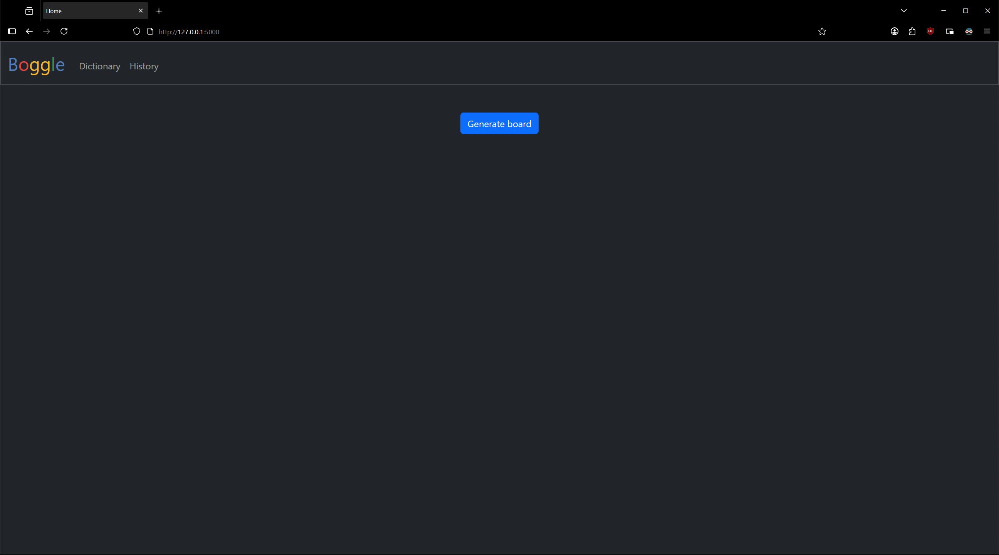  
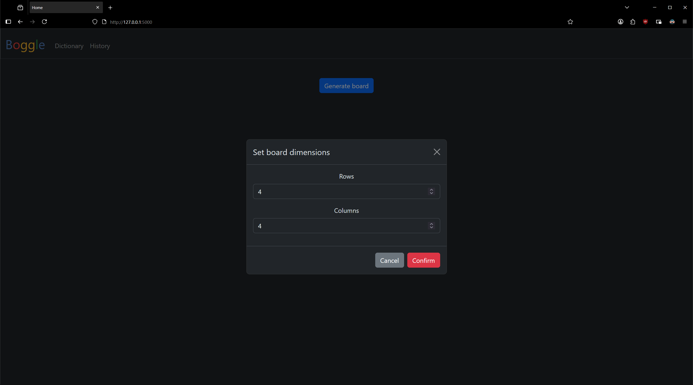  
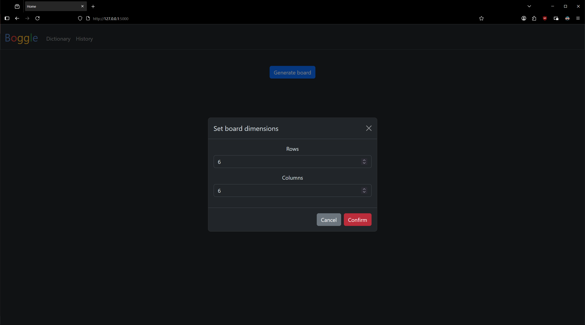  
  
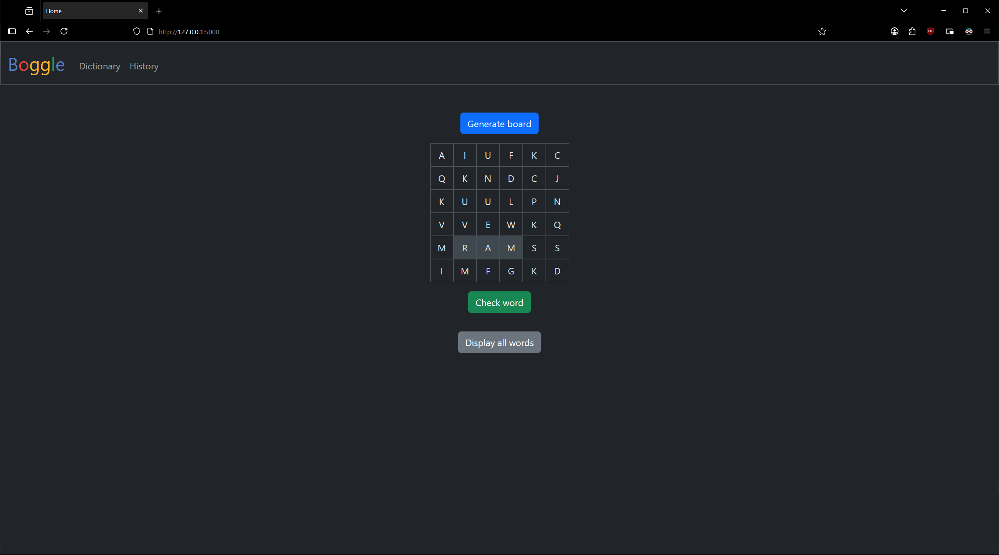  
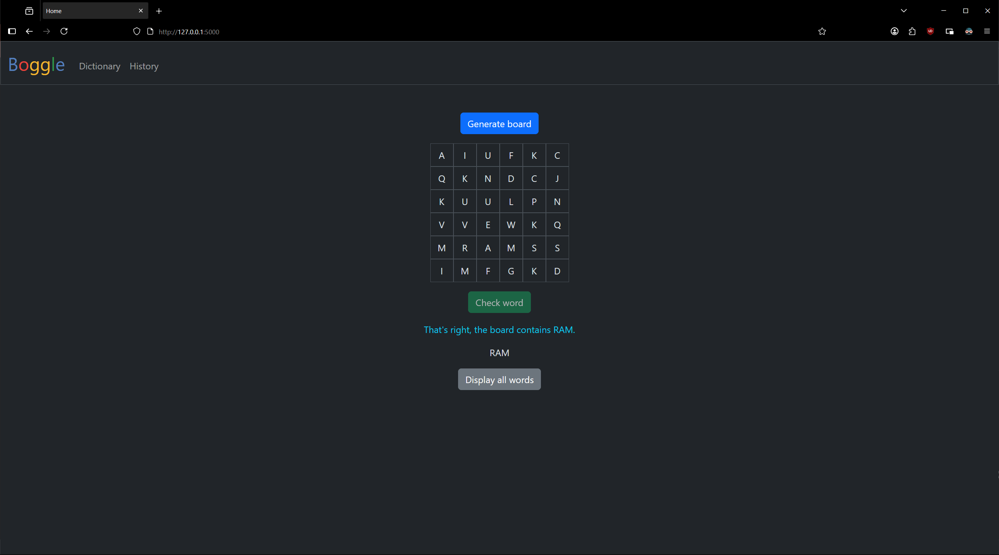  
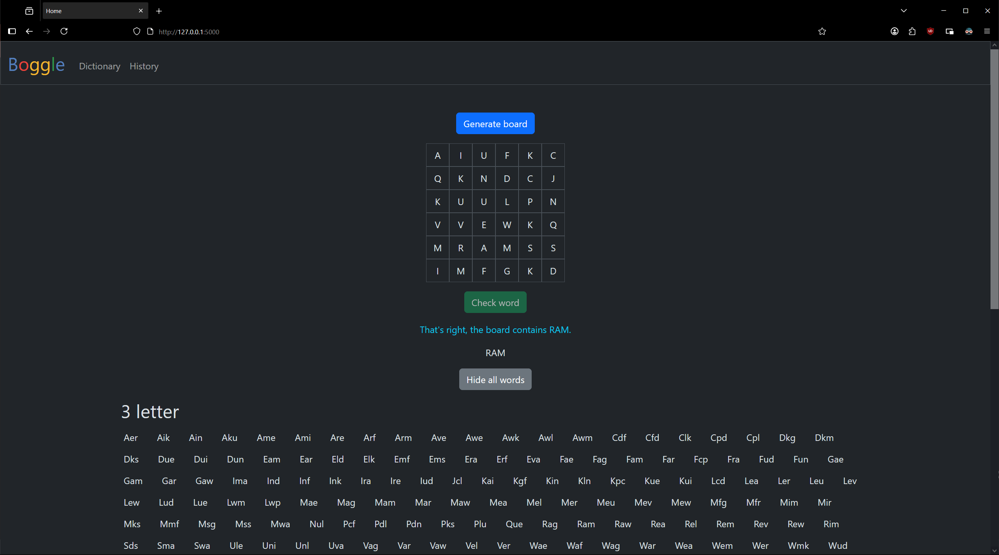  
  
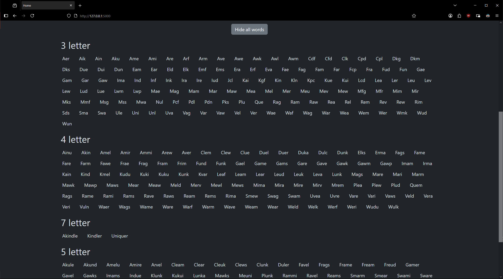  
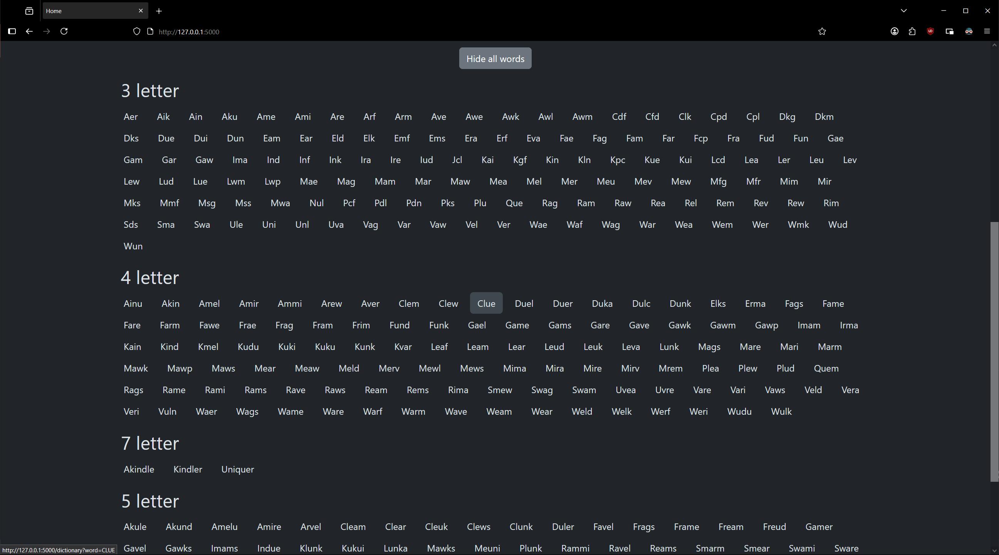  
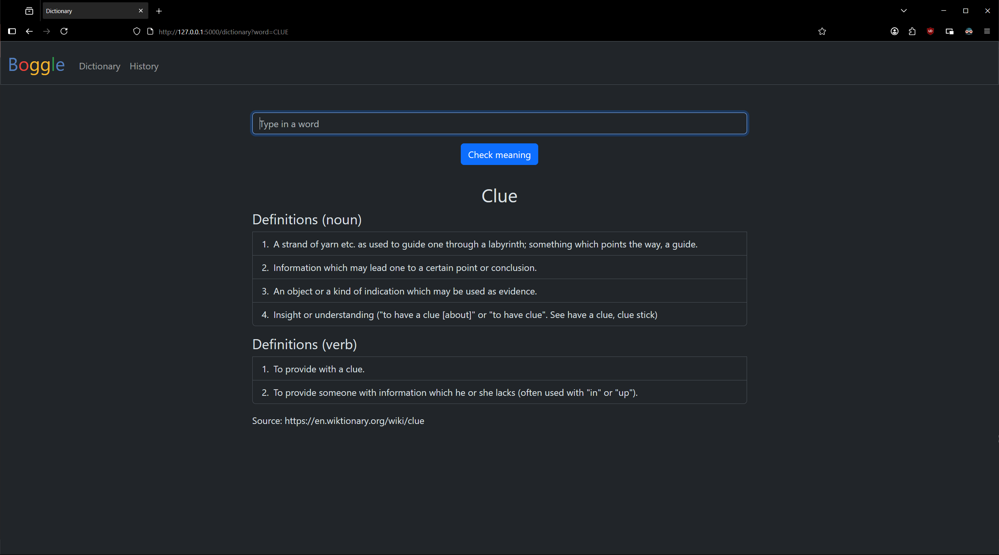  
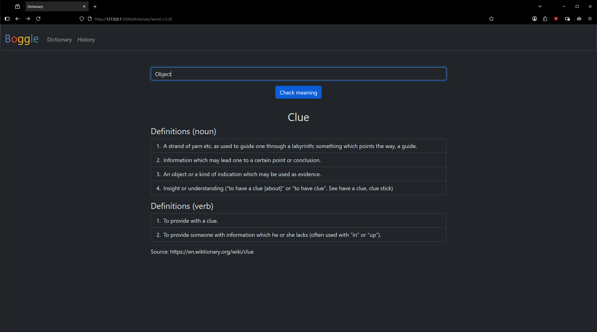  
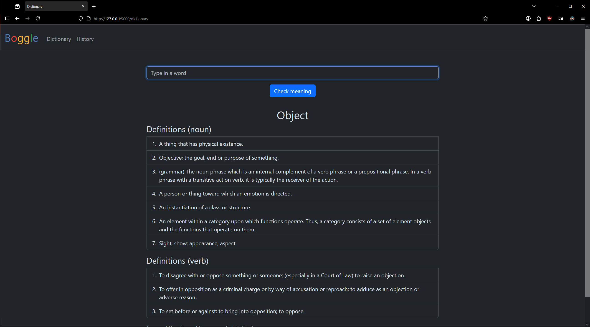  
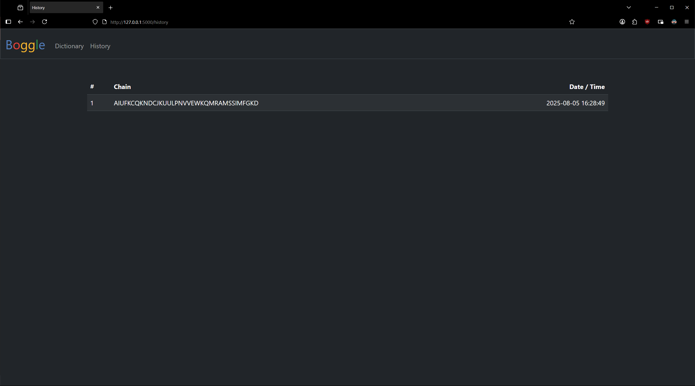  
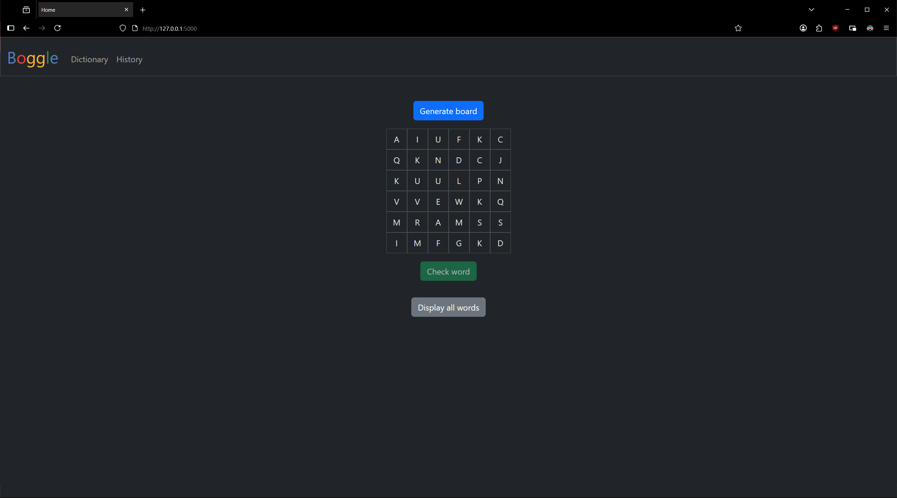

## Tech Stack

Backend:
- Python (Flask)
- SQLite3
- Jinja

Frontend:
- HTML
- CSS (Bootstrap)
- JavaScript, AJAX

## References

- Boggle game logic ([`boggle.py`](boggle.py)) inspired by [GFG Boggle](https://www.geeksforgeeks.org/dsa/boggle-using-trie/)

## License

This project is for educational purposes only and is not licensed for reuse.
